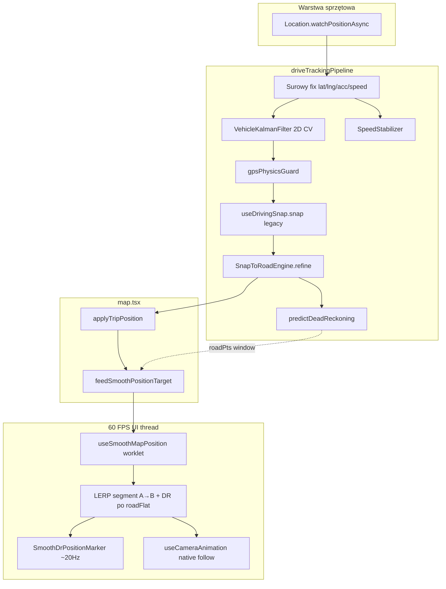

# Drive Mode — architektura śledzenia pozycji (VROOM)

**Data:** 2026-05-27  
**Moduł:** `vroom/lib/driveTracking/` + `vroom/hooks/useDriveTrackingPipeline.ts`  
**Render:** `useSmoothMapPosition` (60 FPS) → `SmoothDrPositionMarker`  
**Kamera:** `useCameraAnimation` + `subscribeSmoothPositionDisplay`

---

## A. Problem i cele

| Objaw | Przyczyna (typowa) | Rozwiązanie w module |
|--------|-------------------|----------------------|
| Teleport wstecz / na bok | Surowy GPS na MarkerView, brak guardów | Kalman 2D + physics guard + feed clamp w `applyTripPosition` |
| 0 km/h w ruchu | Doppler=0 przy dobrym fixie, sanitizer zeruje | `SpeedStabilizer` + sustained/netMove |
| Utrata trasy 90–100 km/h | Opóźnienie GPS, snap na równoległą drogę | DR po łuku + histereza segmentu + szerszy promień przy V>70 |
| Skok na sąsiednią drogę | Najbliższy segment bez kontekstu ruchu | `SnapToRoadEngine` — scoring: lateral + bearing + road credit |

---

## B. Przepływ danych (Data Flow)



**Zasada V10 (bez zmian):** marker **nigdy** nie dostaje surowych współrzędnych z callbacku GPS. Jedyny wpis: `feedSmoothPositionTarget` z `applyTripPosition`.

---

## C. Pliki modułu

| Plik | Odpowiedzialność |
|------|------------------|
| `vehicleKalmanFilter.ts` | Stan [E,N,vE,vN] w płaszczyźnie stycznej; Q/R zależne od prędkości |
| `gpsPhysicsGuard.ts` | Odrzucenie fixów > ~350 km/h (driving); soft clamp kroku |
| `speedStabilizer.ts` | Anty „ghost zero”; EMA; hold 2.2 s przy potwierdzonym ruchu geometrycznym |
| `snapToRoadEngine.ts` | Histereza segmentu, bearing gate, road credit, lateral reject przy V>70 |
| `deadReckoningPredictor.ts` | Predykcja wzdłuż polilinii między fixami |
| `driveTrackingPipeline.ts` | Orchestrator — `filterGpsFix`, `stabilizeSpeedKmh`, `refineSnap` |
| `useDriveTrackingPipeline.ts` | Hook React (jedna instancja na MapScreen) |

Istniejące (bez duplikacji logiki):

| Plik | Rola |
|------|------|
| `hooks/useDrivingSnap.ts` | Map-match / route geometry, pierwszy rzut na polilinię |
| `hooks/useSmoothMapPosition.ts` | Interpolacja 60 FPS, DR po `roadPts` w worklecie |
| `hooks/useCameraAnimation.ts` | Zoom z prędkości, heading, lookahead |
| `lib/mapPosition/smoothPositionFeed.ts` | Most JS → worklet |

---

## D. Filtr Kalmana (pojazd)

Model **constant velocity** w układzie lokalnym ENU (metery):

- **Wejście:** surowe `lat/lng`, `accuracyM`, `timestampMs`, `speedKmh` (tuning Q).
- **Wyjście:** wygładzone `lat/lng`, `velocityMs`, `headingDeg`.
- **Predykcja:** `predictForward(t)` między fixami (wsparcie dla DR).

Przy V > 20 km/h zwiększane `processNoise` — szybsze „doganianie” zakrętów bez teleportów (nadal limituje `gpsPhysicsGuard`).

---

## E. Snap-to-road (zaawansowany)

1. `useDrivingSnap` — pierwsza kotwica (geometria Map Matching / trasa).
2. `SnapToRoadEngine.refine()` — ponowne scoring kandydatów:
   - odległość poprzeczna (lateral),
   - zgodność z `motionBearing`,
   - **bonus** za aktualny `lockedSegmentIndex` (histereza),
   - **kara** za skok indeksu segmentu > 3,
   - promień snap: 32 m (miasto) → 52 m (V ≥ 90 km/h).

Przy odrzuceniu snap (za daleko od raw): hold ostatniej dobrej pozycji zamiast skoku na równoległą ulicę.

---

## F. Animacja markera (LERP / vsync)

`useSmoothMapPosition` (`useFrameCallback`):

1. **Segment A→B:** liniowy LERP pozycji + capped LERP heading (`durationMs` ≈ kadencja GPS).
2. **Po dotarciu do B:** dead reckoning wzdłuż `roadFlat` (okno ±22 pkt z geometrii).
3. **Postój:** pin — odrzucenie feedów < 1.8 m od pinu.
4. **Anti-wstecz:** `isBackwardStepWorklet` — krok > 110° od heading drogi jest blokowany.

`SmoothDrPositionMarker`: `subscribeSmoothPositionDisplay` (~16 ms) → `MarkerView` (Mapbox wymaga JS props).

---

## G. Kamera

`subscribeSmoothPositionDisplay` → `updateCameraFrame`:

- centrum = wygładzona pozycja markera,
- heading = road azimuth przy V ≥ 14 km/h,
- zoom = `zoomFromSpeed(speedKmh)` (już w `useCameraAnimation`),
- lookahead z prędkości.

---

## H. Integracja w map.tsx

```typescript
const driveTracking = useDriveTrackingPipeline();

// Po akceptacji raw GPS:
const filtered = driveTracking.filterGpsFix({
  latitude: rawLat,
  longitude: rawLng,
  accuracyM: acc,
  speedMs: rawSpeedMs,
  headingDeg: loc.heading,
  timestampMs: now,
  isDriving: isDrivingRef.current,
  isNavigating: isNavigatingRef.current,
  accelBypass: accelBypassKalman,
});
if (filtered.rejected) return;
const lat = filtered.latitude;
const lng = filtered.longitude;

// Po sanitizeSpeed + przed/po drivingSnap:
kmh = driveTracking.stabilizeSpeedKmh(kmh, { rawGpsKmh, derivedKmh, sustainedKmh, netMoveM, pathMoveM, isTripActive });

const refined = driveTracking.refineSnap(snapped, {
  rawLat, rawLng, filteredLat: lat, filteredLng: lng,
  speedKmh: snapSpeedKmh, motionBearingDeg, routeHeadingDeg,
  geometry: drivingSnapGeometryRef.current,
  isNavigating, hardRoadLock, accuracyM: loc.accuracy,
});
```

Reset pipeline przy wyjściu z trybu jazdy: `driveTracking.reset()` obok `drivLatFilter.reset()`.

---

## I. Test plan (manual)

1. **Miasto 30–50 km/h** — marker na jezdni, brak skoków na parkingi obok.
2. **Autostrada 90–100 km/h** — marker nie zostaje 50 m w tyle; brak skoków na pas sąsiedni.
3. **Zakręt 90°** — marker jedzie po łuku drogi (nie po skosie chord GPS).
4. **Postój** — brak jitteru, HUD → 0 po ~2 s.
5. **Ruszanie z postoju** — brak 0 km/h przy 15+ km/h (speed stabilizer).
6. **Tunel / słaby GPS** — hold geometrii + DR do kolejnego fixa.

---

## J. Flaga / rollback

Nowy pipeline jest **additive**: legacy `drivLatFilter` można wyłączyć gdy `USE_DRIVE_TRACKING_PIPELINE = true` (w map.tsx). Domyślnie włączony po integracji — w razie regresji ustaw flagę na `false` aby wrócić do 1D Kalman.
