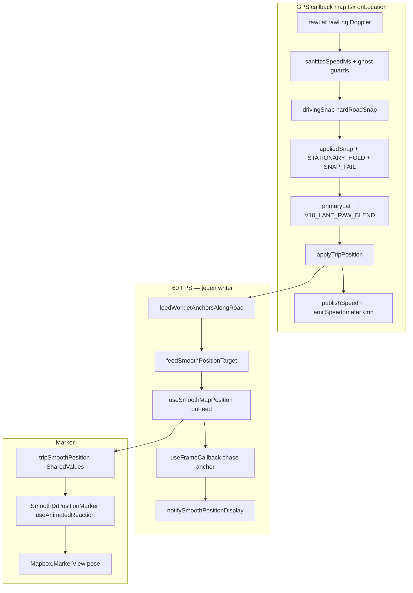

# VROOM V10 — Diagnoza: marker stoi, km/h zamrożone (dla Gemini)

**Data:** 2026-05-26  
**Flaga:** `V10_CLIENT_FIRST = true` (`map.tsx` L175)  
**Symptom użytkownika:** Auto jedzie, HUD/mapę jakby „zamrożone” — marker w miejscu, km/h nie żyje. Po wejściu/wyjściu z apki chwilę działa, potem znowu freeze.

**Telemetria (sesja `map-mpkvkulg-r32o3ul`, iOS ~50 km/h):** plik `map-telemetry-2314-map-mpkvkulg-r32o3ul.jsonl`

**Analiza sesji `map-mpl37vy0-c5l7r5t` (przed fixami resume/worklet):** `map-telemetry-2314-map-mpl37vy0-c5l7r5t.jsonl`

### Tagi trace (od 2026-05-25)

`V10_APPLY_TRIP`, `WORKLET_FEED`, `WORKLET_FEED_REJECT`, `WORKLET_FRAME`, `MARKER_PIPE`, `MARKER_PIPELINE_GAP`, `MARKER_UI_PUSH`, `CAMERA_HEADING`, `RESUME_FREEZE_HOLD`, `BG_PROJECTION_FEED`

---

## 1. Jedno zdanie — co jest źle

**GPS tick nadal przychodzi**, ale pipeline produkuje **tę samą kotwicę snap + `speedMs≈0`** do workletu → Reanimated **nie ma dokąd jechać** → `SmoothDrPositionMarker` nie dostaje nowych współrzędnych → wrażenie „cały tryb jazdy stoi”.

To **nie** jest brak `WORKLET_FEED` (w logach `hasHandler: true`). To **martwa kotwica + zerowa prędkość feedu**, często po pętli snap/speed.

---

## 2. Architektura V10 (stan kodu 2026-05-26)



**Wyłączone w V10 (nie naprawiać tymi ścieżkami):**
- `useDeadReckoning` / `feedDR` w gorącej jeździe (`drEnabled = !V10_CLIENT_FIRST`, L3146)
- `road_frame_glide` RAF
- `MARKER_STUCK_RECOVERY` / `MARKER_PIPE_SPLIT_RESYNC` (`!V10_CLIENT_FIRST`, L6498+)

**Jeden handler worklet:** `useSmoothMapPosition` na `MapScreen` (`tripSmoothPosition`, L1900), przekazany do markera jako `sharedPosition` (L9944–9946). Marker **nie** rejestruje drugiego handlera (L474–478 `SmoothDrPositionMarker.tsx`).

---

## 3. Dowód z logów — sekwencja freeze (~07:19:02–07:19:06)

| Czas | Tag | Znaczenie |
|------|-----|-----------|
| 07:19:02 | `MARKER_PIPE` `markerMovedM: 14` | Marker jeszcze się rusza |
| 07:19:06 | `MARKER_HEARTBEAT` **`stuck: true` `stuckMs: 3775`** | SharedValue **nie zmienia** lat/lng od 3.7 s |
| 07:19:06 | `SPEED_PIPE` **`dtMs: 4318`** `netMoveM: 0` `rawGpsKmh: 48.6` **`sanitizedKmh: 0`** | 4.3 s przerwa; Doppler żywy, geometria ticka 0 |
| 07:19:06 | `SNAP_snap_last_too_far` `lastSnapToRawM: 94` | Stary snap 94 m od raw — geometria „martwa” |
| 07:19:06 | `SNAP_snap_no_match_hard_lock` **`speedKmh: 0`** | Snap z prędkością 0 → tryb postoju w snap |
| 07:19:06 | `SNAP_FAIL_HELD_ANCHOR` | Kotwica trzymana, raw ucieka (`snapToRawM: 148`) |
| 07:19:06 | `WORKLET_FEED` **ta sama** `lat/lng: 49.897809, 21.881997` | Worklet dostaje **stary** target |
| 07:19:06 | `appState` krótko `inactive` → `RESUME_TRIP_ANCHOR` | Wyjaśnia „po wyjściu z apki chwilę działa” |

**Wniosek:** Freeze = **kotwica + speed feed**, nie brak GPS ani brak handlera.

---

## 4. Root cause #1 — Prędkość HUD i `speedMs` do workletu → 0 przy jeździe

### 4.1 Łańcuch zerowania `kmh`

Plik: `map.tsx` (~5348–5490), `speedSanitizer.ts`, `publishSpeed` (~2361–2476).

1. iOS: **lat/lng stoją** (`rawLooksFrozen: true` w `DRIVE_PIPELINE_TICK`), **`netMoveM: 0`** w oknie 3 s.
2. `sanitizeSpeedMs` → `stationaryEvidence` może dać 0 zanim zadziała `dopplerLiveCoordsFrozen` (kolejność warunków w `speedSanitizer.ts` L125–130).
3. Ghost guards: `likelyGhostDopplerStill`, `SPEED_ABRUPT_GHOST_REJECT`, `holdActive` + brak recovery gdy `netMoveM < 14` (`SPEED_HOLD` L5452–5479) — **nawet przy `rawGpsKmh: 48`**.
4. `clampSpeedKmhToGeometry` (L257–285 `speedSanitizer.ts`): przy `netM < 12` i niskiej geometrii **`return 0`** — kasuje Doppler.
5. `publishSpeed` → `SPEED_EMIT_SPIKE_BLOCK` (`absolute_jump`) gdy `prevKmh: 0` → `nextKmh: 200` z `motionKmh` po długim `dtMs` — HUD zostaje na 0.
6. `speedKmhRef.current = 0` → `emitSpeedometerKmh(0)` w `applyTripPosition` (L1423).

### 4.2 `drInputSpeedMs` vs `reliableSpeedMs` w worklet

| Zmienna | Gdzie | Przy `kmh=0` |
|---------|--------|----------------|
| `drInputSpeedMs` | L5502+ | Może być >0 jeśli `rawGpsKmhForSpike >= 8` (L5510) |
| `reliableSpeedMs` w `applyTripPosition` | L1384–1388 | **`0`** jeśli tylko `speedMs` i `speedKmhRef` — **nie patrzy na Doppler** |

**Bug:** Worklet dostaje `speedMs: 0` mimo że `drInputSpeedMs` liczy Doppler → **brak cruise między tickami** (`useSmoothMapPosition.ts` L159: `cruiseMs = speedMs.value >= 0.08 ? ... : 0`).

### 4.3 Logi do weryfikacji

- `SPEED_PIPE` → `sanitizedKmh: 0`, `rawGpsKmh: 45+`, `holdActive: true`
- `SPEED_UNDER_REPORT`, `SPEED_ABRUPT_GHOST_REJECT`, `SPEED_EMIT_SPIKE_BLOCK`
- Brak `SPEED_HOLD_DOPPLER_OVERRIDE` (jeśli fix nie wdrożony / nie trafia warunek)

---

## 5. Root cause #2 — Snap trzyma starą pozycję (`SNAP_FAIL` + geometria)

### 5.1 `useDrivingSnap.ts`

- L369–387: `snap_last_too_far` — gdy `lastSnapToRawM > MAX_SNAP_TO_RAW_DISTANCE_M`, czyści `lastSnappedRef` → brak match.
- L635–653: `snap_no_match_hard_lock` — brak wyniku; przy `speedKmh: 0` w logu → **`stationary = speedKmh < 6`** (L323) → węższy promień, gorszy match.
- Wywołanie: `drivingSnap(..., snapSpeedKmh, ...)` — jeśli **`kmh` już 0** przed snap, snap myśli że stoimy.

### 5.2 `map.tsx` po snap fail (V10)

- L6026–6052: `resolveV10SnapFailPosition` — krok wzdłuż polilinii **max ~16 m** (`kmh * 0.28`).
- Jeśli **`kmh === 0`**: `computeSnapFailMaxStepM` (L402–412) może dać **0** gdy `rawDriftM < 0.5` — kotwica **nie rusza**.
- L6184–6188: `SNAP_FAIL_HELD_ANCHOR` — diagnostyka: snap fail, trzymamy `appliedSnap` blisko hold.
- L6313–6353: `STATIONARY_HOLD` — pin do `lastDrivingPosRef` gdy `kmh < 8` i brak `movementWake` — **zamraża `appliedSnap`** nawet gdy Doppler > 5 (wake jest, ale `kmh` już wyzerowane wcześniej).

### 5.3 Martwa geometria drogi

- `ROAD_MATCH_GEOM_REJECT` — raw za daleko od polilinii (`maxGeomDistM: 52`).
- `MATCH_add_interval_gate` **`waitMs: 26000`** — API map-match **nie odświeża** geometrii ~26 s.
- `MARKER_PIPE` `roadPts: 2` — degenerowana polilinia (2 punkty) → `stepTowardSnapOnPolyline` / sub-kotwice **bezużyteczne**.

---

## 6. Root cause #3 — Worklet „dojeżdża” i stoi (martwa kotwica)

Plik: `useSmoothMapPosition.ts` L149–175.

```typescript
if (distAnchorM > 0.04) {
  // chase anchor — LERP
} 
// else: BRAK ruchu gdy marker już na kotwicy
```

Jeśli kolejne `WORKLET_FEED` dają **ten sam** `anchorLat/anchorLng` (logi: wielokrotnie `49.897809, 21.881997`):

1. `distAnchorM <= 0.04` → **zero przesunięcia** w klatce.
2. `speedMs === 0` → brak forward cruise.
3. `useAnimatedReaction` w markerze nie woła `pushMarkerCoord` → **`MARKER_HEARTBEAT stuck: true`**.

### 6.1 `feedWorkletAnchorsAlongRoad` (`map.tsx` L1254–1347)

| Problem | Mechanizm |
|---------|-----------|
| **Krok max 12 m/tick** | L1330: `stepM = min(12, speedMs * tickSec)` — przy dużym opóźnieniu GPS target **daleko**, feed idzie **12 m** podczas gdy auto pojechał 200 m → kotwica ciągle „z tyłu”, czasem **ten sam** stepped point. |
| **Sub-kotwice + timery** | `setTimeout` L1308 — przy lagu JS **kolejka timerów**; stary feed nadpisuje nowy. |
| **Desync `lastWorkletFeedAnchorRef`** | Po sub-path ustawiany `lastSub` (L1321) ale worklet może być już na innym miejscu. |
| **`movedM > 40` reset** | L1287 — bezpośredni feed (fix); poniżej 40 m nadal stepped. |

### 6.2 Handler i remount

- `registerSmoothPositionHandler` (`smoothPositionFeed.ts` L78–104): replay `lastTarget` przy remoncie — może **cofnąć** marker.
- `useSmoothMapPosition` cleanup: `clearSmoothPositionFeed()` (L130) — przy chwilowym `isTripActiveMap=false` kasuje feed.

---

## 7. Root cause #4 — Krótkie tło / resume („działa po wyjściu z apki”)

- `appState: inactive` (~4.7 s) → `tripResumeFreezeUntilRef` (L8039, L4519–4621).
- `RESUME_TRIP_ANCHOR` + `RESUME_FREEZE_INSTANT_RELEASE` — reset kotwic, jeden duży skok.
- Potem znowu: `SPEED_ABRUPT_GHOST_REJECT` + `SPEED_EMIT_SPIKE_BLOCK` + snap fail → **pętla freeze**.

---

## 8. Co NIE jest przyczyną (częste mylące ścieżki)

| Hipoteza | Dlaczego nie |
|----------|----------------|
| Brak handlera worklet | Logi: `WORKLET_FEED hasHandler: true` |
| `SmoothDrPositionMarker` kasuje handler | Fix: `sharedPosition` → `SmoothDrPositionMarkerBody` bez drugiego hooka |
| `DRIVING_JUMP_REJECT return` | Zamienione na clamp (nie cały tick) |
| DR 60 FPS w V10 | `V10_CLIENT_FIRST` wyłącza DR w jeździe |
| rAF w markerze | Usunięte — tylko `useAnimatedReaction` + SharedValue |

---

## 9. Mapa plików — gdzie szukać

| Objaw | Plik | Funkcja / log |
|-------|------|----------------|
| km/h = 0 | `map.tsx` | `sanitizeSpeedMs`, ghost, `publishSpeed`, `clampSpeedKmhToGeometry` |
| km/h = 0 | `speedSanitizer.ts` | `sanitizeSpeedKmh`, `clampSpeedKmhToGeometry` |
| Snap stoi | `useDrivingSnap.ts` | `snap`, `snap_last_too_far`, `snap_no_match_hard_lock` |
| Snap fail V10 | `map.tsx` | `resolveV10SnapFailPosition`, `SNAP_FAIL_HELD_ANCHOR` |
| Postój pin | `map.tsx` | `STATIONARY_HOLD` L6313+ |
| Feed worklet | `map.tsx` | `feedWorkletAnchorsAlongRoad`, `applyTripPosition` |
| Worklet stoi | `useSmoothMapPosition.ts` | `useFrameCallback` L164–175 |
| Marker UI | `SmoothDrPositionMarker.tsx` | `MARKER_HEARTBEAT`, `useAnimatedReaction` |
| Feed bus | `smoothPositionFeed.ts` | `feedSmoothPositionTarget`, `WORKLET_FEED` |

---

## 10. Wdrożone fixy (2026-05-26 — cascading failure path)

| Fix | Plik |
|-----|------|
| Doppler ≥15 nie zeruje HUD (`stationaryEvidence`, `clamp`, `publishSpeed`) | `speedSanitizer.ts`, `map.tsx` |
| `reliableSpeedMs` z Doppler ≥15 / ≥2.2 m/s do worklet | `map.tsx` `applyTripPosition` |
| `emitSpeedometerKmh` floor przy raw ≥15 | `map.tsx` |
| Snap `effectiveSpeedKmh = max(speed, doppler)` | `useDrivingSnap.ts` |
| `computeSnapFailMaxStepM` krok przy `rawDriftM > 1` | `map.tsx` |
| `STATIONARY_HOLD` tylko gdy Doppler <15 | `map.tsx` |
| Worklet emergency cruise `cruiseMs >= 2.2` | `useSmoothMapPosition.ts` |
| Direct feed przy >40 km/h lub movedM>30 | `feedWorkletAnchorsAlongRoad` |

---

## 11. Proponowane kierunki fix (priorytet dla implementacji)

### P0 — Marker musi dostać ruch (nawet gdy snap/kmh zawiodły)

1. **`applyTripPosition` → `reliableSpeedMs`:** `max(speedMs, rawGpsKmhRef/3.6)` gdy `isDriving && rawGps >= 8`.
2. **`useSmoothMapPosition`:** gdy `distAnchorM < 0.05` ale `cruiseMs > 0`, **jazda do przodu** po `anchorHdg` (`speedMs * dt`) — nie stój na duplikacie kotwicy.
3. **`feedWorkletAnchorsAlongRoad`:** jeśli `haversine(prev, target) > 20 m` → **bez** stepped/sub-timers, jeden feed na `target`; jeśli stepped ≈ prev → feed **target** wprost.

### P0 — km/h musi żyć przy Doppler ≥ 15

4. Po wszystkich guardach: `if (rawGpsKmh >= 15 && kmh < 8) kmh = rawGpsKmh`.
5. `publishSpeed`: `dopplerTrustedEmit` — nie `SPEED_EMIT_SPIKE_BLOCK` przy Doppler ≥ 15.
6. `resolveV10SnapFailPosition` / snap: używać `max(kmh, rawGpsKmh)` nie samego `kmh`.

### P1 — Snap / geometria

7. Przy `snap_last_too_far` + `rawGpsKmh >= 15`: wymusić `guardedForceMapMatch` (nie czekać 26 s gate).
8. Nie trzymać `STATIONARY_HOLD` gdy `rawGpsKmh >= 15`.
9. Ograniczyć / wyłączyć `setTimeout` sub-kotwice przy `speedMs > 11` (autostrada).

---

## 12. Checklist testu po fixie

1. Start jazdy @ 40–60 km/h — w 3 s: `sanitizedKmh > 0`, marker jedzie, `MARKER_HEARTBEAT stuck: false`.
2. 60 s jazdy — brak serii `WORKLET_FEED` z **identycznym** lat/lng > 3 s.
3. Krótkie tło 5 s — po powrocie bez 4 s `dtMs` + `sanitizedKmh: 0` przy `rawGpsKmh > 40`.
4. Logi: brak długiego `SNAP_FAIL_HELD_ANCHOR` + `speedKmh: 0` przy `rawGpsKmh > 40`.

---

## 13. Stare docs

`GEMINI_MARKER_SPEED_BRIEF.md` opisuje **rAF w markerze** i stary worklet z `moveToward` — **nieaktualne**. Źródło prawdy dla freeze: **ten plik** + `GEMINI_MARKER_FULL_SYSTEM.md` sekcja K2/K3.

---

## 14. Sesja `map-mpl3zdcv-gh48tzm (1).jsonl` — fix wdrożony (2026-05)

**5000 zdarzeń, 21× stuck (max 33340 ms), 454× MARKER_PIPELINE_GAP, 504/576× apply z `feedMoveM<0.5` przy żywym `feedSpeedMs`, 0× V10_RAW_CHASE (build bez chase).**

### Wdrożone w kodzie

| Obszar | Zmiana |
|--------|--------|
| SSOT | `advanceV10MarkerTowardRaw` w `applyTripPosition` (+ `rawLat/rawLng/roadPts`); log `V10_APPLY_CHASE` / `V10_CHASE_FAIL` |
| Arc feed | `v10_arc_stale_snap` w `feedWorkletAnchorsAlongRoad` gdy `movedM<1.5` i `speedMs>3` |
| Worklet | `staleAnchorDrive` (forward ×1.85 po 400 ms martwej kotwicy); `WORKLET_STALL` co 2 s |
| Feed gate | `setMarkerStaleRawToSnapM`; bypass `v10_duplicate_micro` przy dryfie >15 m lub `dt>800ms`; `WRITER_CONFLICT` |
| Priorytet | `stall_recovery`, `v10_arc_stale_snap` ponad cruise duplicate |
| Geometria | `markerStaleSnapTicks` → `forceImmediate` match; sparse geom cooldown 6 s przy `rawToSnapM>25` |
| GAP | `MARKER_PIPELINE_GAP` → natychmiastowy `applyTripPosition` z chase |
| Kolizje | `SNAP_STALE` hard rescue → `applyTripPosition` zamiast `feedDR`; stall bez podwójnego feedu |
| Cruise | chase tylko w `applyTripPosition` (usunięty duplikat przed apply) |

### Tagi w nowym JSONL

`V10_APPLY_CHASE`, `V10_CHASE_FAIL`, `V10_ARC_FEED`, `WORKLET_STALL`, `WRITER_CONFLICT`

### OTA

```powershell
cd D:\VROOM\vroom
eas update --branch production --message "fix: V10 stale snap chase + arc feed + worklet stall"
```

### Sesja `map-mpl5q39s-sqcoil3` — postój 330 km/h + snap off-road (2026-05-25)

**Log:** 132 zdarzeń — `DRIVING_JUMP_CLAMP` z `jumpM` do **2.5M m** (teleport GPS), `motionKmh: 200` przy `sanitizedKmh: 0`, `V10_APPLY_CHASE` przy `speedMs: 1.5` i `roadPts: 2`, `TRIP_SEGMENT` `fallbackKm` rośnie przy odrzuconych skokach.

**Przyczyna:** chase/arc/GAP reagowały na `motionKmh>=6` mimo postoju; `TRIP_MAX_PLAUSIBLE_KMH=360` wpuszczał derived speed do achievementów.

**Fix:** `canV10ProgressMarker` (postój, rawStep>42m, brak Doppler≥8); GAP/arc tylko przy `trustDopplerInTrip`; `useTripStats` cap **200** km/h; peak/achievement cap `MAX_REALISTIC_DRIVING_KMH`; `isParkedLike` przy `motionKmh>=80` bez ruchu.

### V10 pięćwarstwowa telemetria (gpsTickId)

Każdy tick GPS: `beginGpsTick` → `RAW_GPS_TICK` → łańcuch z tym samym `gpsTickId` / `gpsTickAgeMs`.

| Warstwa | Tag | Plik | Throttle |
|---------|-----|------|----------|
| 1 HUD | `SPEED_HUD_DIAG` | `map.tsx` `publishSpeed` | 450 ms; 0 przy `hudFrozenSuspect` |
| 2 Snap | `SNAP_PIPELINE_END` | `map.tsx` przed `applyTripPosition` | brak (1×/tick) |
| 2b | `SNAP_RESULT_LIFECYCLE` | po snap | brak |
| 3 Feed | `FEED_WORKLET_CALL` | `applyTripPosition`, `feedWorkletAnchorsAlongRoad`, `smoothPositionFeed` | brak |
| 4 Worklet | `WORKLET_FRAME_DIAG` | `useSmoothMapPosition` frame | 1 s lub `distToPredictM>10` |
| 5 UI | `MARKER_UI_RENDER` | `SmoothDrPositionMarker` | 1 s |

Analiza JSONL: filtruj po `gpsTickId` z `RAW_GPS_TICK`, sortuj po `gpsTickAgeMs`.

### P0 anti-teleport (V10 live cruise)

- `forceInstantFeed = isInstant && allowInstantFeed` — **nigdy** `feedMoveM >= 20`.
- `smoothDurationMs` clamp **180–420 ms** (worklet LERP, nie `durationMs: 0`).
- `skipRawChase` gdy `roadPts.length > 2` — brak cięcia zakrętów za surowym GPS.
- `normalizeSmoothTarget`: nieznane źródło z `durationMs:0` → **200 ms** + `FEED_INSTANT_COERCED`.
- Resume / one-shot / stall: bez `instant` poza entry (`allowInstantFeed: true`).
- Worklet: dynamic LERP `BASE_SMOOTH_FACTOR=0.35`, do **0.75** przy `distAnchorM>15`.
- UI: trip marker tylko `drLatRef` / `lastSetLocRef` / worklet pose — nie `userLocation`.
