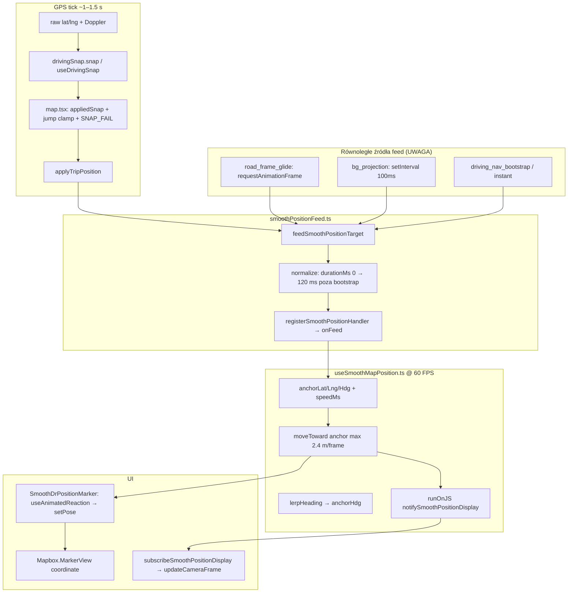

# VROOM V10 — Pełny opis działania markera + problem użytkownika (dla Gemini)

**Data dokumentu:** 2026-05-24  
**Flaga:** `V10_CLIENT_FIRST = true` w `vroom/app/(tabs)/map.tsx`  
**Stack:** React Native, Reanimated worklet, Mapbox `MarkerView`, GPS ~1–2 s, Map Matching API

---

## A. Problem użytkownika (do rozwiązania)

Użytkownik jedzie **normalnie**, snap „jest”, ale:

1. **Marker obok drogi** — nie na jezdni, przesunięty w bok.
2. **Zakręt** — marker **nie skręca po drodze**, tnie **po skosie** na mapie (jak linia prosta między dwoma punktami GPS).
3. **Czasem teleport** — marker ląduje **w zupełnie innym miejscu** niż auto.
4. **Oczekiwanie (Google Maps):** marker ma **płynnie się przesuwać** (slide), **nie skakać** co przejechaną odległość.

To NIE jest ten sam bug co „HUD 00 przy wolnej jeździe” (osobny pipeline prędkości) — ale może współistnieć.

---

## B. Docelowe zachowanie (akceptacja)

| Kryterium | Opis |
|-----------|------|
| Pozycja | Na środku pasa / na polilinii drogi z map-match |
| Ruch | Ciągły, ≤ ~2–3 m widocznego kroku na klatkę @ 60 FPS |
| Zakręt | Marker podąża **łukiem drogi**, nie chordem GPS |
| Snap fail | Krótko trzyma ostatnią dobrą geometrię, potem powolny powrót — bez skoku 20–50 m |
| Postój | Stoi stabilnie, bez jitteru |

---

## C. Architektura — diagram przepływu (stan aktualny)



---

## D. Pliki i odpowiedzialności

| Plik | Rola |
|------|------|
| `vroom/app/(tabs)/map.tsx` | GPS handler, snap pipeline, `applyTripPosition`, `road_frame_glide`, prędkość HUD |
| `vroom/hooks/useDrivingSnap.ts` | Snap do `roadMatchPtsRef` / `routePtsRef`, `targetHeading` z segmentu |
| `vroom/hooks/useDrivingMapMatch.ts` | Map Matching API → `applyRoadMatchPoints` → geometria |
| `vroom/scripts/navigationUtils.ts` | `snapToRoute`, `snapStepTowardRoad`, `stepTowardSnapOnPolyline` |
| `vroom/lib/mapPosition/smoothPositionFeed.ts` | Most JS↔worklet, `feedSmoothPositionTarget` |
| `vroom/hooks/useSmoothMapPosition.ts` | Worklet: poślizg do kotwicy |
| `vroom/components/map/SmoothDrPositionMarker.tsx` | MarkerView (throttle 33 ms z SharedValue) |
| `vroom/scripts/speedSanitizer.ts` | HUD — osobny od markera |

**Wyłączone w V10:** `useDeadReckoning` (`drEnabled = !V10_CLIENT_FIRST`) — `onFrame` tylko sync refów, **nie** feeduje markera.

---

## E. Pipeline GPS → kotwica snap (map.tsx)

### E.1. Wejście

- `Location.watchPositionAsync` → handler w `map.tsx` (trip active: driving lub navigation).
- `hardRoadSnap = isDrivingRef.current`.
- `drivingSnap.snap(lat, lng, kmh, isNavigating, hardRoadSnap, acc)` → `useDrivingSnap`.

### E.2. useDrivingSnap — logika skrót

1. Geometria: `roadMatchPtsRef` (priorytet) lub `routePtsRef`.
2. Brak geometrii + `hardRoadLock` → hold / krok po bearing / raw (`SNAP_FAIL` w praktyce).
3. Z geometrią: rzut na najbliższy **segment** polilinii (`findNearestOnPolyline`), `targetHeading = segmentBearing`.
4. Promienie snap: 22–60 m zależnie od tier; **lateral reject** > 25 m przy > 25 km/h.
5. iOS: potwierdzenie zmiany segmentu (anti wrong parallel road).
6. Zwraca `{ latitude, longitude, snapped, targetHeading }`.

**Ważne:** `snapToRoute` w `navigationUtils` zwraca **tylko punkt** na segmencie, **nie** bearing — bearing jest w `useDrivingSnap`.

### E.3. map.tsx po snap — `appliedSnap`

| Krok | Warunek | Akcja |
|------|---------|--------|
| SNAP_FAIL V10 | `hardRoadSnap && !snapped.snapped` | `resolveV10SnapFailPosition()` — 5 s wzdłuż `drivingSnapGeometryRef`, potem krok do raw |
| Duży skok | `jumpM > maxJumpM` (~20 m V10) | `stepTowardSnapOnPolyline` (jeśli geometria) lub `clampCoordStep` (po **skosie** — gorsze) |
| Sukces | `snapped.snapped` | `lastSnapSuccessAtRef = now`, streak=0 |
| Heading | zawsze | `resolveUnifiedHeading` → `drivingHeading` (droga > GPS) |
| Wyjście | V10 | `applyTripPosition(primaryLat, primaryLng, { heading, speedMs: drInputSpeedMs })` |

**Refs geometrii:**

- `drivingSnapGeometryRef` — punkty z map-match (aktualizowane `applyRoadMatchPoints`).
- `routePointsRef` — trasa nawigacji (nav).

### E.4. applyTripPosition (V10)

```typescript
feedSmoothPositionTarget({
  latitude: lat,      // snapped primary
  longitude: lng,
  heading,
  durationMs: 380–900 ms (z gpsCadenceMsRef),
  speedMs: reliableSpeedMs,  // tylko tempo doganiania kotwicy w worklecie
  source: 'v10_live_cruise' | 'v10_apply_trip_instant',
});
```

- **Nie** woła `notifySmoothPositionDisplay` (tylko worklet).
- `skipWorkletFeed: true` — async `getLocalSnapTarget` refinement (mikro-ruch, ping-pong ryzyko).

---

## F. Worklet — useSmoothMapPosition.ts (stan 2026-05-24)

### F.1. onFeed (kotwica)

- Ustawia `anchorLat/Lng/Hdg`, `anchorPullMs` (320–900 ms), `speedMs`.
- **Bootstrap / instant:** kopiuje `lat/lng/heading` od razu + opcjonalny notify.

### F.2. useFrameCallback (każda klatka)

**Usunięte:** `projectMetersWorklet` (dead reckoning na prosto) — to było główne **cięcie zakrętów po skosie**.

**Aktualnie:**

```typescript
distAnchorM = distance(marker, anchor);
chaseStep = min(2.4 m, distAnchorM, cruiseMs*dt, distAnchorM/remainingSec*dt);
marker = moveToward(marker, anchor, chaseStep);  // interpolacja liniowa lat/lng
heading = lerpHeading(marker, anchorHdg);
notify → JS co 16 ms (kamera)
```

**Interpretacja:** Marker to **poślizg w stronę kotwicy snap** z GPS. Jeśli kotwica skacze po chordie (clamp 16 m), marker goni po chordie — **nadal wygląda jak skos na zakręcie**.

### F.3. speedMs w worklecie

- Nie jedzie „do przodu” — tylko zwiększa `chaseStep` do kotwicy.
- `0` → wolniejsze doganianie (min `frameDtSec * 1.8`).

---

## G. Marker UI — SmoothDrPositionMarker.tsx

1. `sharedPosition` z `MapScreen` (`tripSmoothPosition`).
2. `useAnimatedReaction` na `lat/lng/heading` SharedValue.
3. `runOnJS(pushMarkerCoord)` throttle **33 ms** → `setPose` → `MarkerView` `coordinate={[lng, lat]}`.
4. Rotacja: `useAnimatedStyle` na `heading` SharedValue (zsynchronizowane ze workletem).

**Ograniczenie Mapbox:** `MarkerView` wymaga props z JS — nie ma natywnej animacji coordinate w RN; throttle 33 ms to kompromis.

---

## H. Dodatkowe źródła feedSmoothPositionTarget (konflikty)

| source | Kiedy | Ryzyko |
|--------|-------|--------|
| `v10_live_cruise` | Każdy GPS tick | **Główne SSOT** — OK |
| `road_frame_glide` | RAF 60 FPS gdy `now - lastTripTargetUpdateAt > 220 ms` | `snapStepTowardRoad(cur, road, 2.2m)` — może ciągnąć na **zły segment** równoległej drogi; **walczy z kotwicą GPS** |
| `bg_projection` | iOS background co 100 ms | `snapStepTowardRoad` lub `projectCoord` |
| `driving_nav_bootstrap` | Wejście w trip, `durationMs: 0` | Jednorazowy skok |
| `stall_recovery` | Marker stuck | Skok rescue |
| `bump_active_*` | Poza V10 trip / instant | Rzadkie w V10 |
| `smooth_marker_mount` | Mount markera | `durationMs: 320` |

**Gemini:** rozważyć **jeden writer** do feedu (kolejka lub priorytet GPS > glide) albo glide tylko gdy `dist(marker, anchor) < X`.

---

## I. Funkcje geometryczne (navigationUtils.ts)

### snapToRoute

- Najbliższy punkt na odcinku polilinii w promieniu `maxSnapMeters`.
- Zwraca `{ latitude, longitude }` — **bez indeksu segmentu / bearing**.

### snapStepTowardRoad

- Rzut bieżącej pozycji na drogę, potem krok max `maxStepM` w stronę rzutu.
- **Nie** idzie w stronę docelowego GPS — tylko koryguje lateralnie do najbliższego punktu na polilinii od **aktualnej** pozycji markera.

### stepTowardSnapOnPolyline

- Od `hold` w stronę `target` (raw lub snap) **po polilinii** (używane przy SNAP_FAIL i `jumpM > maxJumpM`).

---

## J. Dlaczego użytkownik nadal widzi bugi (analiza root cause)

### J1. Zakręt po skosie (najważniejsze)

| Warstwa | Mechanizm |
|---------|-----------|
| **Kotwica GPS** | Co ~1.5 s nowy punkt; między tickami worklet goni **po linii prostej** do kotwicy (`moveToward` = lerp lat/lng) |
| **jump clamp** | Nawet `stepTowardSnapOnPolyline` max **8–16 m/tick** — na ostrym zakręcie chord **omija łuk** |
| **Brak arc-length** | Google Maps interpoluje **wzdłuż polyline od A do B** w czasie, nie „do punktu B po skosie” |
| **road_frame_glide** | `snapStepTowardRoad` z bieżącej pozycji — na zakręcie może wybrać **inny segment** (Y-fork, równoległa ulica) |

### J2. Marker z boku drogi

| Przyczyna | Mechanizm |
|----------|-----------|
| Zła geometria map-match | Polyline z równoległego segmentu (stary match, API) |
| Lateral snap cap | `clampSnapTowardRaw` / max 25–45 m od raw |
| Snap na zły segment | `findNearestOnPolyline` global minimum — nie „forward along route” |
| glide + GPS mismatch | Glide ciągnie na inny segment niż kotwica z `v10_live_cruise` |

### J3. Teleport w inne miejsce

| Przyczyna | Mechanizm |
|----------|-----------|
| `durationMs: 0` bootstrap | Natychmiastowy skok pozycji worklet |
| `registerSmoothPositionHandler` replay `lastTarget` | Remount |
| SNAP_FAIL po 5 s | Krok w stronę raw GPS po polu |
| `getLocalSnapTarget` refinement | Async snap z SQLite/tiles (ping-pong) — `skipWorkletFeed` ale zmienia refs |
| Map-match recovery | `applyRoadMatchPoints` — nagła zmiana polilinii |

### J4. „Skok co przejechaną odległość”

- Stary model: clamp 20 m + DR forward — **częściowo usunięty**.
- Nadal: gdy `distAnchor > chaseStep * frames`, marker **dogania** w kilku klatkach po linii prostej → widoczny skok 10–20 m przy słabym GPS.

---

## K2. Wdrożone 2026-05-24 (rekomendacja Gemini — arc-length + single writer)

| Zmiana | Plik |
|--------|------|
| **Usunięto `road_frame_glide` RAF** | `map.tsx` — koniec multi-writer |
| **`generateSubAnchorsAlongPolyline`** | `navigationUtils.ts` — sub-kotwice wzdłuż łuku |
| **`feedWorkletAnchorsAlongRoad`** | `map.tsx` — sub-kotwice + `v10_live_cruise` co GPS tick |
| **Worklet smooth-damper** | `useSmoothMapPosition.ts` — heading z ruchu markera; chase bez martwej strefy |
| **Forward-only snap window** | `useDrivingSnap.ts` — okno + global override tylko przy `segLeap <= 6` |

## K3. Wdrożone 2026-05-26 (fix freeze 0 km/h + snap)

| Zmiana | Plik |
|--------|------|
| **`DRIVING_JUMP_REJECT` → clamp** | `map.tsx` — nigdy `return` całego ticka w jeździe |
| **`reportedKmh = max(Doppler, motionKmh)`** | `map.tsx` — Android `speed=0` nie blokuje sanity |
| **Trust Doppler ≥15 km/h** | `map.tsx`, `speedSanitizer.ts` — coords zamrożone, HUD żywy |
| **Wyłączony fałszywy `STATIONARY_HOLD`** | `map.tsx` przy jeździe z Doppler/raw move |
| **`lastWorkletFeedAnchorRef` = pozycja feed** | `map.tsx` — łańcuch sub-kotwic po drodze |
| **`stepTowardSnapOnPolyline` arc-length** | `navigationUtils.ts` — `getPointAtDistanceAlongPath` |
| **`V10_LANE_RAW_BLEND`** | projekcja raw na polilinię + gate heading 35° |
| **Handler ownerId** | `smoothPositionFeed.ts` — marker nie kasuje handlera mapy |
| **Freeze po przerwie GPS (telemetry)** | Doppler ≥15 przy `netMoveM≈0`; desync worklet feed `movedM>40`; sub-kotwice tylko &lt;11 m/s |

**Pełna diagnoza freeze (dla Gemini):** [`GEMINI_MARKER_FREEZE_DIAGNOSIS.md`](GEMINI_MARKER_FREEZE_DIAGNOSIS.md)

---

## K. Co już wdrożono (historia fixów)

- `tripStandstillNetM()` — postój 4 m / 12 m (HUD + marker speed feed).
- Usunięto rAF drugą interpolację w markerze → `useAnimatedReaction`.
- Worklet bez `projectMetersWorklet` (bez jazdy na prosto po heading).
- `stepTowardSnapOnPolyline` / `resolveV10SnapFailPosition`.
- `road_frame_glide` między tickami GPS.
- `durationMs: 0` → 120 ms poza bootstrap w `smoothPositionFeed`.

---

## L. Propozycje dla Gemini (priorytet)

### L1. P0 — Ruch wzdłuż drogi jak Google Maps (arc-length)

**Problem:** `moveToward(anchor)` to chord, nie łuk.

**Propozycja:**

1. Przy każdym GPS tick: zapisz `prevAnchor` i `newAnchor` na polilinii.
2. W worklet (lub JS co 16 ms): pozycja = **interpolacja arc-length** między `prev` a `new` po `drivingSnapGeometryRef` (wymaga przekazania segment index / offset — trudne w worklet).
3. **Alternatywa prostsza (JS):** między GPS tickami w `road_frame_glide` nie `snapStepTowardRoad(cur)` tylko **advance along polyline** od `lastAnchor` w stronę `currentAnchor` o `speed*dt` metrów na łuku.

```typescript
// Pseudokod
function advanceAlongPolyline(fromIdx, fromOffsetM, polyline, distanceM): {lat, lng, idx, offset}
```

### L2. P0 — Jeden writer feedu

- Wyłączyć lub throttle `road_frame_glide` gdy ostatni feed był `v10_live_cruise` < 500 ms.
- Albo: glide tylko koryguje lateral error `dist(marker, snapToRoute(marker)) < 8m`, nie zmienia postępu wzdłuż trasy.

### L3. P1 — Forward-only snap

- W `useDrivingSnap`: wybór segmentu z **prognozą do przodu** (dot product z velocity / segment index monotonic), nie globalny nearest (eliminuje równoległą drogę i „bok”).

### L4. P1 — Kotwica między tickami

- Zamiast jednego skoku kotwicy co GPS: **queue 3–8 sub-anchorów** wzdłuż polyline między `lastSetLoc` a `appliedSnap` (feed co 80 ms).

### L5. P2 — Mapbox native

- Rozważyć `@rnmapbox/maps` PointAnnotation z native driver lub custom layer — jeśli dostępne w RN Mapbox 10+.

### L6. P2 — Telemetria

Logować w jednym evencie:

```json
{
  "rawLat", "snapLat", "markerLat",
  "jumpM", "lateralM", "segmentIdx",
  "feedSource", "distAnchorM", "headingDelta"
}
```

---

## M. Stałe aktualne

| Stała | Wartość |
|-------|---------|
| `MAX_FRAME_STEP_M` (worklet) | 2.4 m |
| `anchorPullMs` | 320–900 ms |
| `maxJumpM` V10 driving | 20 m (potem stepAlongPolyline cap 8–16 m) |
| `road_frame_glide` step | 2.2 m / frame gdy GPS idle > 220 ms |
| `MARKER_COORD_PUSH_MS` | 33 ms |
| `tripStandstillNetM` | 4 m (<15 km/h), 12 m inaczej |
| `MOVING_THRESHOLD_MS` | 0.08 m/s |

---

## N. Prompt do wklejenia w Gemini

```
Przeczytaj załączony dokument VROOM V10 (GEMINI_MARKER_FULL_SYSTEM.md).

Problem: marker w jazdzie ma snap, ale na zakręcie jedzie po skosie (chord), bywa z boku drogi, czasem teleportuje. Ma płynnie pełząc jak Google Maps.

Stan kodu:
- Worklet NIE robi już dead reckoning po heading — tylko moveToward(anchor) max 2.4m/frame.
- GPS co ~1.5s ustawia kotwice przez drivingSnap + stepTowardSnapOnPolyline przy dużym skoku.
- Równolegle RAF road_frame_glide woła snapStepTowardRoad co klatkę gdy GPS nie świeżył się >220ms.

Zaproponuj KONKRETNY minimalny diff:
1) interpolacja wzdłuż polilinii (arc-length) między tickami GPS, nie chord do anchor;
2) jeden writer feedSmoothPositionTarget (usunąć konflikt glide vs GPS);
3) forward-only segment selection w useDrivingSnap;
4) jak zmierzyć sukces (metry lateral / max jump per second).

Podaj nazwy funkcji w: map.tsx, useSmoothMapPosition.ts, navigationUtils.ts, useDrivingSnap.ts.
```

---

## O. Fragmenty kodu (referencja)

### worklet chase (useSmoothMapPosition.ts)

```typescript
const chaseStep = Math.min(
  MAX_FRAME_STEP_M,  // 2.4
  distAnchorM,
  Math.max(cruiseMs * frameDtSec * 1.02, (distAnchorM / remainingSec) * frameDtSec, frameDtSec * 1.8),
);
const pulled = moveTowardWorklet(lat, lng, anchorLat, anchorLng, chaseStep);
```

### road_frame_glide (map.tsx)

```typescript
if (now - lastTripTargetUpdateAtRef.current < 220) return;
const stepped = snapStepTowardRoad(curLat, curLng, roadPts, 75, 2.2);
feedSmoothPositionTarget({ ...stepped, source: 'road_frame_glide', durationMs: 100 });
```

### jump along road (map.tsx)

```typescript
if (jumpM > maxJumpM) {
  const c = roadPts.length >= 2
    ? stepTowardSnapOnPolyline(last.lat, last.lng, snapped.lat, snapped.lng, roadPts, stepCap, 90)
    : clampCoordStep(...);  // chord — unikać jeśli jest geometria
}
```

---

*Koniec dokumentu — wersja zgodna z kodem po refaktorze 2026-05-24.*
